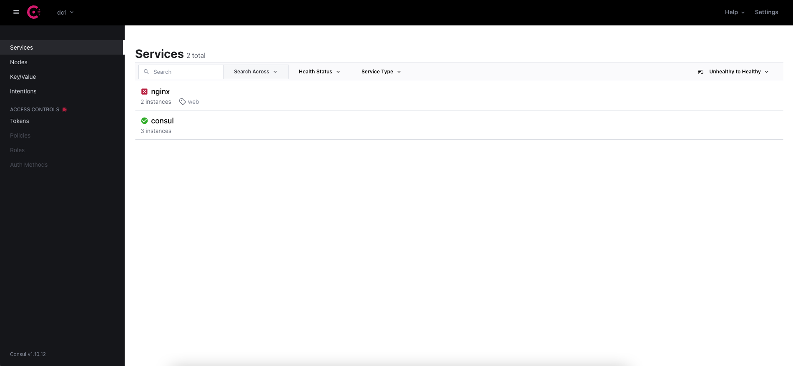

# Docker Consul Example

### About

Docker compose example for consul service discovery

### Concepts

- Service Discovery

### Commands

```bash
docker-compose up -d
```

### Result

Consul dashboard in http://localhost:8500



### Create by
© [Giovane Santos](https://giovanesantossilva.github.io/)
